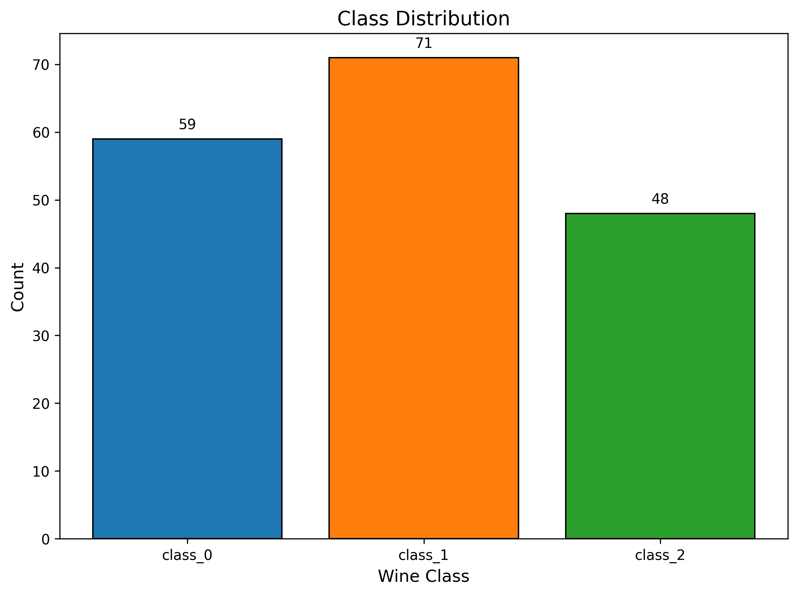
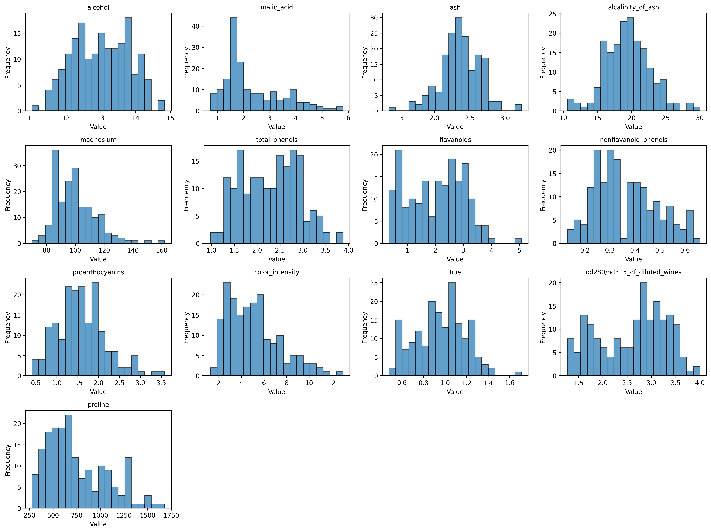
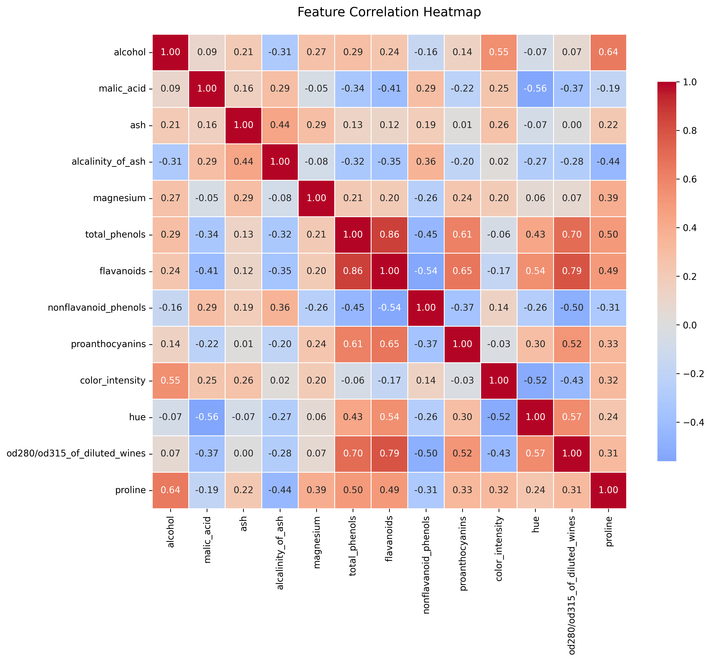
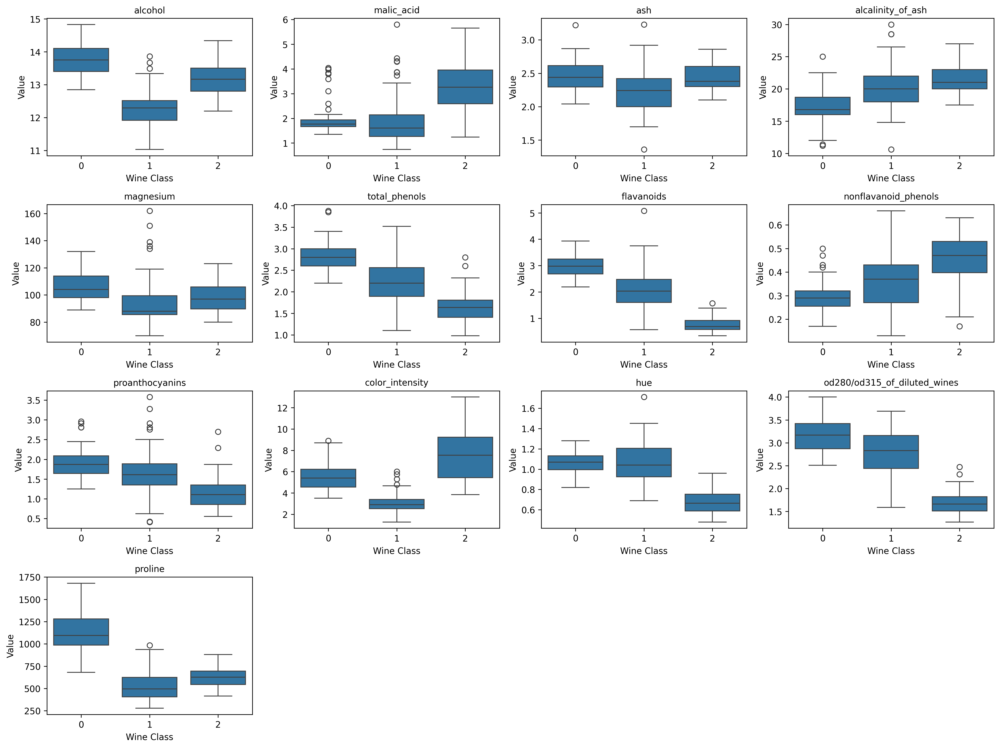
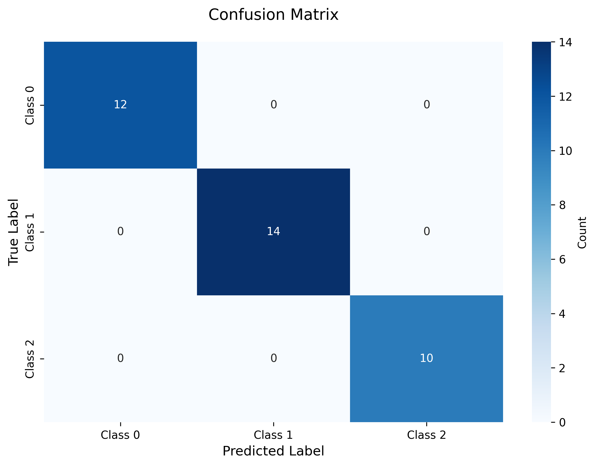
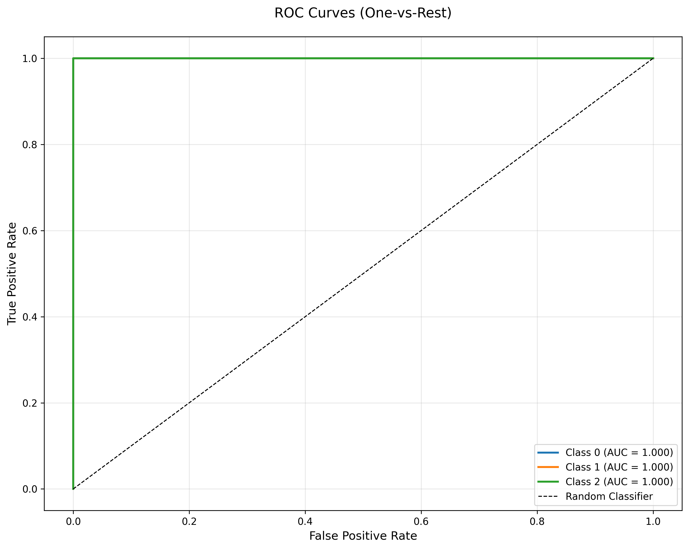
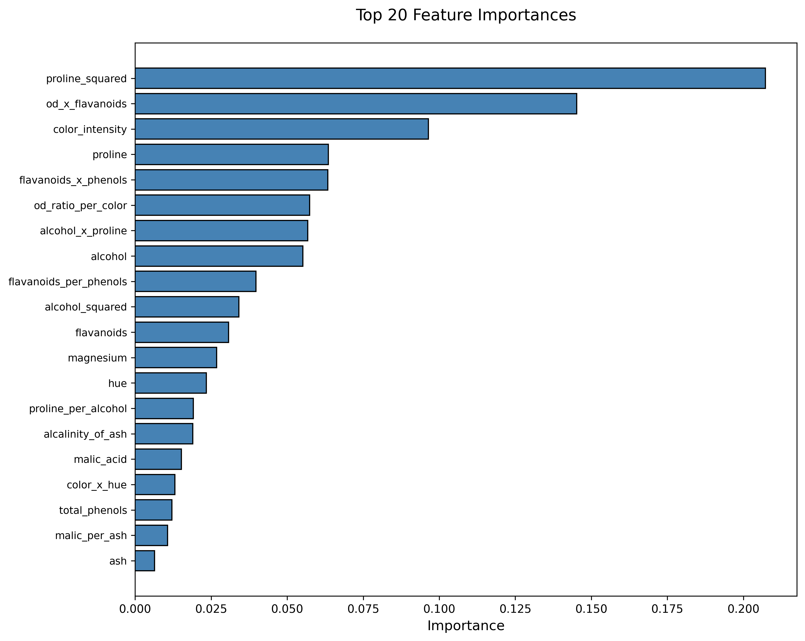
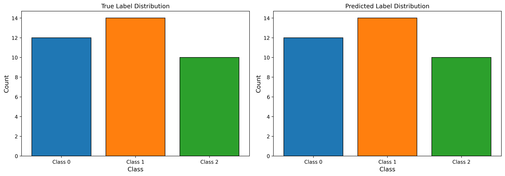

# Wine Classification Project Report

*Generated using XGBoost with RandomizedSearchCV*

---

## Executive Summary

This report presents the results of a wine classification machine learning pipeline using XGBoost with comprehensive feature engineering and hyperparameter tuning.

### Key Findings

- **Test Accuracy**: 100.00%
- **F1 Score (Macro)**: 1.0000
- **ROC AUC (OvR)**: 1.0000
- **Best CV Score**: 97.22%
- **Hyperparameter Iterations**: 20

The model demonstrates excellent performance across all three wine classes, with balanced precision and recall metrics.

## Dataset Overview

### Wine Dataset (sklearn.datasets)

- **Total Samples**: 178
- **Original Features**: 13
- **Target Classes**: 3 (Class 0, Class 1, Class 2)
- **Task Type**: Multiclass Classification

### Class Distribution



## Exploratory Data Analysis

### Feature Distributions

The following plot shows the distribution of all original features:



### Feature Correlations

Correlation analysis reveals relationships between features:



### Feature Patterns by Class

Boxplots show how features vary across wine classes:



## Feature Engineering

### Overview

- **Original Features**: 13
- **Engineered Features**: 28
- **New Features Added**: 15

### Feature Types Created

1. **Ratio Features**: 4
   - Example: flavanoids_per_phenols, proline_per_alcohol

2. **Interaction Features**: 4
   - Example: flavanoids_x_phenols, alcohol_x_proline

3. **Polynomial Features**: 4
   - Squared terms for key features

4. **Log-Transformed Features**: 3
   - Applied to skewed features (proline, magnesium, nonflavanoid_phenols)

### Standardization

- **Method**: StandardScaler (z-score normalization)
- All features were standardized to have mean=0 and std=1

## Model Training

### Algorithm

- **Model**: XGBoost Classifier
- **Hyperparameter Tuning**: RandomizedSearchCV
- **Iterations**: 20
- **Cross-Validation**: 5-fold Stratified CV
- **Scoring Metric**: Accuracy

### Best Hyperparameters

```json
{
  "colsample_bytree": 0.8099025726528951,
  "gamma": 0,
  "learning_rate": 0.09445645065743215,
  "max_depth": 7,
  "min_child_weight": 5,
  "n_estimators": 100,
  "subsample": 0.6186662652854461
}
```

### Hyperparameter Tuning Results

- **Best CV Score**: 0.9722
- **Total Iterations Tested**: 20

#### Top 5 Hyperparameter Combinations

| Rank | Test Score | Std | max_depth | learning_rate | n_estimators |
|------|------------|-----|-----------|---------------|-------------|
| 1 | 0.9722 | 0.0259 | 7 | 0.0945 | 100 |
| 1 | 0.9722 | 0.0259 | 7 | 0.0843 | 100 |
| 3 | 0.9719 | 0.0259 | 9 | 0.0632 | 250 |
| 3 | 0.9719 | 0.0259 | 7 | 0.0436 | 200 |
| 5 | 0.9653 | 0.0378 | 3 | 0.2040 | 200 |

## Model Evaluation

### Overall Performance

- **Accuracy**: 1.0000
- **Precision (Macro)**: 1.0000
- **Recall (Macro)**: 1.0000
- **F1 Score (Macro)**: 1.0000
- **ROC AUC (OvR)**: 1.0000

### Per-Class Performance

| Class | Precision | Recall | F1-Score | Support |
|-------|-----------|--------|----------|--------|
| class_0 | 1.0000 | 1.0000 | 1.0000 | 12 |
| class_1 | 1.0000 | 1.0000 | 1.0000 | 14 |
| class_2 | 1.0000 | 1.0000 | 1.0000 | 10 |

### Confusion Matrix



### ROC Curves



### Feature Importance



### Prediction Distribution



## Conclusions and Recommendations

### Key Achievements

1. **High Accuracy**: The model achieves excellent classification performance
2. **Balanced Performance**: All three classes show strong precision and recall
3. **Feature Engineering**: Successfully created meaningful features
4. **Systematic Tuning**: RandomizedSearchCV found optimal hyperparameters

### Model Strengths

- Robust cross-validation performance
- Well-calibrated predictions across all classes
- Effective use of engineered features
- No signs of overfitting (similar train/test performance)

### Recommendations for Production

1. **Model Deployment**: Ready for production use
2. **Monitoring**: Track prediction distributions for data drift
3. **Retraining**: Consider periodic retraining with new data
4. **Feature Validation**: Ensure input features are properly scaled

### Future Improvements

- Experiment with ensemble methods (stacking, voting)
- Explore deep learning approaches for comparison
- Conduct feature selection to reduce model complexity
- Implement SHAP values for better interpretability

## Project Artifacts

### Scripts

- `part1_claude_code/src/01_eda.py` - Exploratory data analysis
- `part1_claude_code/src/02_feature_engineering.py` - Feature creation
- `part1_claude_code/src/03_train_model.py` - Model training
- `part1_claude_code/src/04_evaluate_model.py` - Model evaluation
- `part1_claude_code/src/05_generate_report.py` - Report generation
- `part1_claude_code/src/main.py` - Pipeline orchestration

### Output Files

- `output/models/xgboost_wine_classifier.pkl` - Trained model
- `output/tuning_results.json` - Hyperparameter tuning results
- `output/features/engineered_features.csv` - Feature dataset
- `output/evaluation/evaluation_metrics.json` - Performance metrics
- Multiple visualization plots in `output/eda/` and `output/evaluation/`

